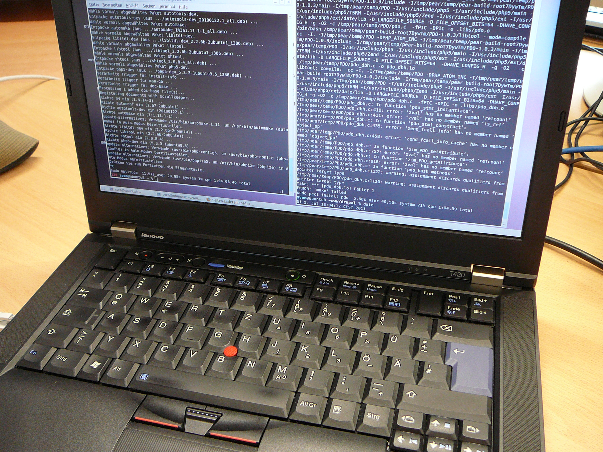
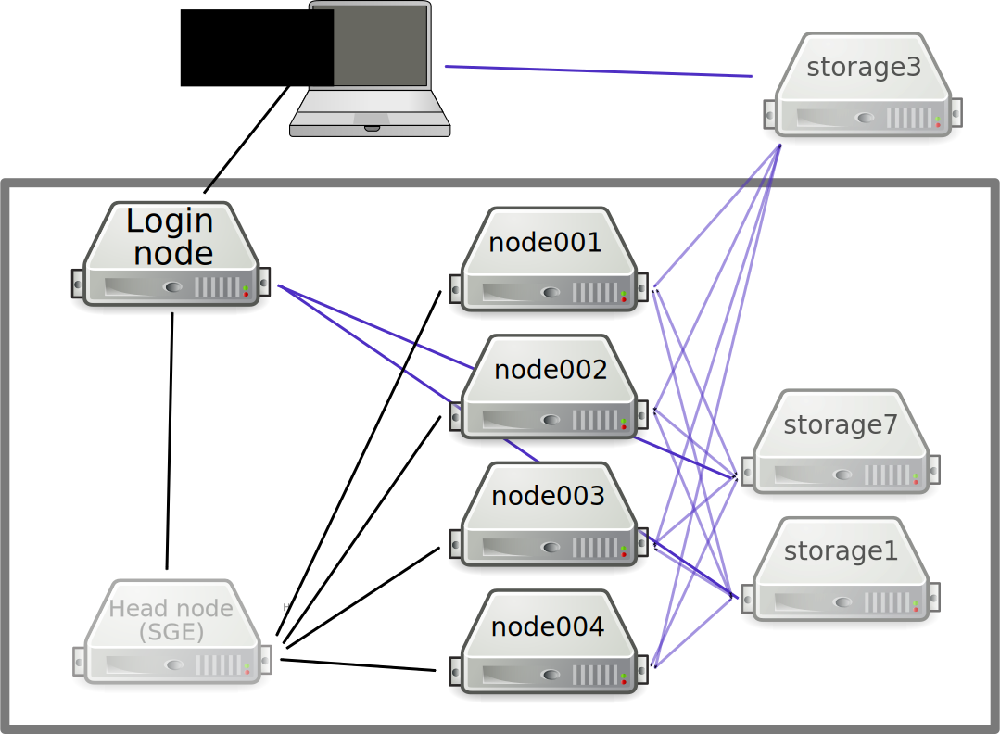

# High-Performance Computing at the University of Sheffield

<div class="right">
    
</div>

Will Furnass

Research Software Engineering team, University of Sheffield

2019-02-12

---
## Outline

 1. What is HPC? Why bother?
 1. HPC at UoS
 1. Using HPC
 1. Further resources

---
## Personal machines for research



  - Edit and run code in one place
  - ~4 cores - some parallelism
  - Full control!

but...

---
## Limitations of personal machines

  - Limited RAM
  - Basic CPU
  - Limited num of cores
  - Limited, fragile storage
  - Modest GPU
  - Limited network connection
---
## Limitations of personal machines

  - How to distribute work *between* laptops?
  - How to run a series of tasks overnight?
      - "1am: Check if run 3 finished & start run 4"
      - "3am: Check if run 4 finished & start run 5"
      - "5am: Check if run 5 finished & start run 6"

---
## HPC: how is it different?

'HPC' == computer cluster with:
  - Computing resources
    - many nodes
    - each with many cores, much RAM, maybe GPUs
    - connected by fast networking
  - Storage
    - both shared and per-node
    - resilient and fast
  - Job management
    - Queue up jobs to run over a week
  - Command-line as default interface
  - Linux OS + optimised research software

---
## UoS Clusters

- ShARC: newer UoS cluster
- Iceberg: older UoS cluster
- Bessemer: next UoS cluster

---
## DCS HPC resources (now)

  - Majority of nodes **public** (free at point of use)
  - But DCS has some **private nodes** in ShARC:
    - Non-std hardware specs
    - Less contention (sometimes!)
  - DCS node specs:
     - 1x node with **8x NVIDIA P100 GPUs** & 512GB RAM
     - 3x nodes with **768GB RAM** each
     - 4x nodes with **32 cores** each

---
## DCS HPC resources (soon)

### ShARC 
- 5x nodes w/ 768GB RAM and 1TB SSDs

### Bessemer
- 7x GPU nodes for Bessemer (4x V100 with NVLink & 192GB memory)

---
## Cluster structure



---
## Jupyter

- Can also run Jupyter Notebooks on cluster.
- Ask for more info

---
## Moving data to/from HPC

  - SSH-based methods are your friends here (`rsync`, `scp`, `sftp`)
  - Or 
      - Use a storage area directly accessible to both your local machine and HPC?
      - Just use HPC?

---
## Storage

Location            | Shared? | Quota | B'ups? | Multi-HPC
------------------- |:-------:| -----:|:------:|:---------:
`/home/$USER`       | Y       | 10GB  | Y      | Y
`/data/$USER`       | Y       | 100GB | Y      | Y
`/fastdata/$USER`   | Y       | -     | N      | Y'
`/scratch`          | N       | -     | N      | N
`/shared/$PROJNAME` | Y       | 10TB  | N      | Y

---
## Storage

Location            | Remote access? | Speed | Suited to       
------------------- |:-------------- |:----- |:---------------
`/home/$USER`       | SSH            | >     | Pers data       
`/data/$USER`       | SSH            | >     | Pers data       
`/fastdata/$USER`   | SSH            | >>>   | Tmp big files   
`/scratch`          | -              | >>>   | Tmp small files 
`/shared/$PROJNAME` | SSH + CIFS     | >     | Proj files      


---
## Running jobs

- Users submit jobs to **Grid Engine** (SGE) job scheduler 
    - A **distributed resource manager**
    - Not intuitive!
    - V. powerful
- Request 
    - **Interactive** or **batch** job
    - Run time (e.g. 2h or 4d)
    - Computational resources (cores, RAM, GPUs)
    - Access to private resources
    - Notifications
- If request cannot be satisfied in ~60s
    - Interactive jobs fail 
    - Batch jobs start queueing

---
## Example interactive session

```
[me@mylaptop ~]$ ssh te1st@sharc.sheffield.ac.uk
...
[te1st@sharc-login1 ~]$ qrshx -P rse \
                              -pe smp 2 \
                              -l rmem=16G \
                              -m bea \
                              -M myemail@sheffield.ac.uk \
                              -j y 
[te1st@sharc-node121 ~]$ ./my_simulation_program --num-cores=2
...
```

---
## Example batch job script

Create a shell script, `my-job-script.sh`:

```bash
#!/bin/bash
#$ -P rse 
#$ -pe smp 2 
#$ -l rmem=16G 
#$ -m bea 
#$ -M myemail@sheffield.ac.uk
#$ -j y 

./my_simulation_program --num-cores=2
```

Then submit this to Grid Engine:

```console
[me@mylaptop ~]$ ssh te1st@sharc.sheffield.ac.uk
[te1st@sharc-login1 ~]$ qsub my-job-script.sh
```
Now go home for dinner!

---
## After submitting a job

You can then:
 - Wait for an email notification (success/abort)
 - Check status (running/queueing)
 - Cancel/amend job

---
## Resource estimation

 1. Run short test jobs
 1. View resource utilisation
 1. Extrapolate
 1. Submit larger jobs

---
## Software on UoS HPC

### Centrally-installed, optimised software

* Compilers, libraries, apps, dev tools etc
* Activate a package by **loading a modulefile** e.g.

    ```sh
    module use $MODULENAME
    ```

---
Where, for e.g. cuDNN, `$MODULENAME` could be one of:

```
libs/cudnn/4.0/binary-cuda-7.5.18
libs/cudnn/5.1/binary-cuda-7.5.18
libs/cudnn/5.1/binary-cuda-8.0.44
libs/cudnn/6.0/binary-cuda-8.0.44
libs/cudnn/7.0/binary-cuda-8.0.44
libs/cudnn/7.0/binary-cuda-9.1.85
...
```

---
## Software on UoS HPC

### Manage your own software

Several options:

  - Install non-optimised binary packages in e.g. your home directory 
      - *Conda*
  - Build optimised software stacks from source
      - *Spack*, *EasyBuild*
  - Run containers
      - *Singularity* - similar to *Docker*

All useful for e.g. provisioning/using complex Deep Learning software stacks!

---
## Optimisation and parallelisation

- Laptop may be *faster* than single-core job on ShARC:
    - CPUs in servers run at lower clock speeds
    - `.exe` may not exploit advanced CPU features

- Performance often comes from >=1 of:
    - **Optimising** for **CPU architecture**
    - **CPU parallelism** (multiple cores, multiple nodes)
    - **Accelerators** (GPUs, TPUs, Xeon Phi etc)

---
### Optimising for CPU architecture

  - In ShARC most CPUs are Xeon Haswell 
  - Haswell has support for hardware vectorisation
  - and *fused add-multiply* (useful for matrix mult)
  - Either use pre-compiled libraries that can dynamically use these
      - e.g. Intel Math Kernel Library (MKL)
  - or compile to produce builds optimised for Haswell

---
### CPU parallelism

(At least) 5 flavours:

#### Shared memory

- Single node
- Multiple CPU cores
- Typically 1 thread per core
- Thread-local and shared variables
- Many applications do this via OpenMP and/or Intel MKL

---
#### Distributed memory (single node)

- Multiple CPU cores
- Typically 1 process per core
- Separate address spaces
- Data (and code?) passed between processes
- e.g. `joblib` w/ multiprocessing or `ipyparallel`; MATLAB parfor; R `parallel`/`foreach`

---
#### Distributed memory (multiple nodes)

- Multiple CPU cores per node (symmetric?)
- Typically 1 process per core
- Separate address spaces per process
- Data (and code?) passed between processes
    - within a node
    - between nodes
- V. fast interconnects between nodes
- Facilitated by 
    - MPI (API + software for exploiting fast interconnects)
    - Apps/libs that understand MPI (`ipyparallel`, `PETSc`, MATLAB DCE)

---
#### Task arrays

- Set of near identical tasks
- Embarrassingly parallel
- Scheduled separately by Grid Engine
- Which then packs out its schedule with them!
- Great for sensitivity analyses

---
#### Accelerators, specifically CUDA

- Massive data parallelism
- Very effective for linear-algebra-heavy ops
    - ML, DL
- Can either write low-level code in CUDA
- Or use higher-level libs that speak CUDA
    - Tensorflow, PyTorch etc for DL

---
#### Other options

High-level APIs for working with large datasets, possibly out of core:

 - Spark
 - Dask

---
## Going bigger!

- Potential issues
    - Jobs too big / queue times too long for ShARC?
    - Want newer GPUs/processors?
---
- Options
    - JADE: Tier 2 HPC facility for Deep Learning (*lots* of GPUs)
    - Other Tier 2 facilities
    - Tier 1 HPC facility: Archer
    - Cloud (AWS, Azure, GCP etc)
        - Alces Flight - traditional HPC in the cloud

---
## Learning more / getting help

* Docs: `https://docs.hpc.shef.ac.uk` (not a tutorial)
* **Workshops**
    * RSE team runs various workshops on fundamentals:
        * UNIX shell, Git, Python/R/MATLAB, relational databases...
    * and more advanced topics:
        * multithreading/multiprocessing, CUDA, deep learning...
    * CiCS also offer training in C/C++, Fortran, Python, MATLAB and HPC

---
## Research software: learning more / getting help

* **Talks**
    * RSE seminar series 
* **Code Clinic**
    * Book an appointment to get help with a coding issue
* **Hire an RSE** to help with your project(s)!
    * Either as part of a grant proposal
    * Or just for a few days

---
For more info (inc. **mailing list** and events schedule) see [https://rse.shef.ac.uk/](https://rse.shef.ac.uk/).

<div class="middle">
    <div class="center">
        
    </div>
</div>

---
## The RSE team

* 9 RSEs
* Team kick-started by 2x EPSRC fellowships
* Based in Computer Science
* Some current projects:
    * High-performance **agent-based modelling** (CUDA)
    * Deep learning and workflows for **NLP**
    * MRI **image alignment** (registration) software (C++/PETSc)
    * Agile **web apps** for visualising datasets (R/Shiny)
    * Augmenting **cell modelling** software (C++/PETSc)

---
## Getting in touch

<i class="fa fa-globe fa-lg"></i>&nbsp;[https://rse.shef.ac.uk](https://rse.shef.ac.uk)

<i class="fa fa-envelope fa-lg"></i>&nbsp;[rse@sheffield.ac.uk](maito://rse@sheffield.ac.uk)

<i class="fa fa-github fa-lg"></i>&nbsp;[@RSE-Sheffield](https://github.com/RSE-Sheffield/RSE-Sheffield.github.io)

<i class="fa fa-twitter fa-lg"></i>&nbsp;[@RSE_Sheffield](https://twitter.com/rse_sheffield)
